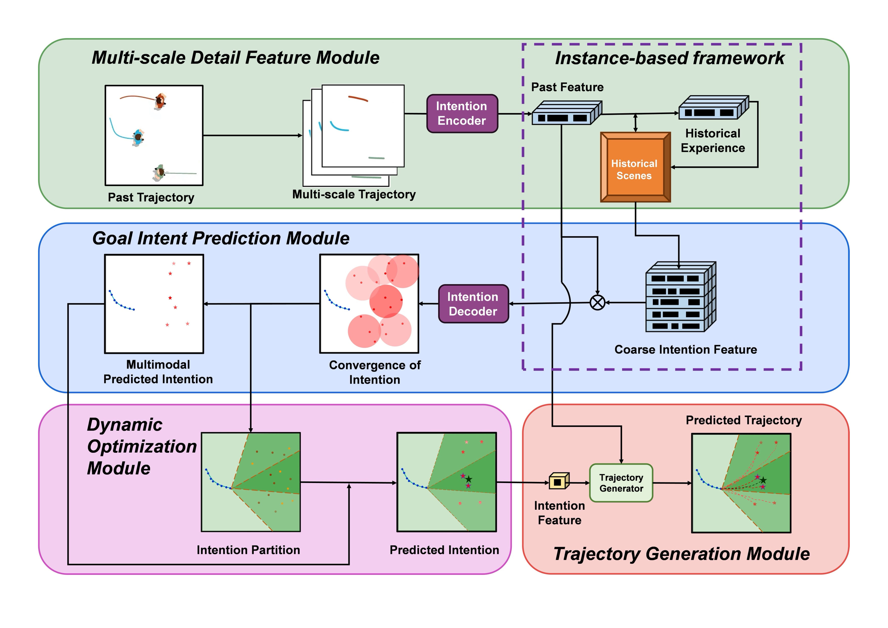
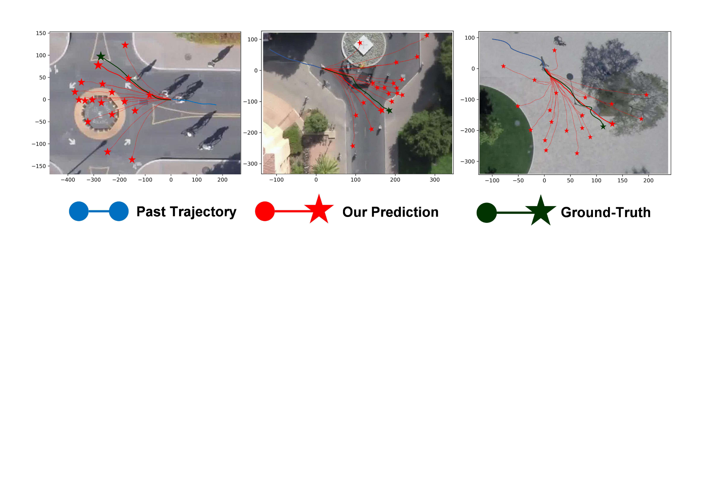

# DPIU: Dynamic Pedestrian Intention Understanding Through Cognitive Decision-Making

**Official PyTorch code**



**Abstract**:Accurate prediction of pedestrian motion is crucial for autonomous driving, particularly in path planning and col lision avoidance applications. Most current methods concentrate on spatio-temporal feature parameters(e.g., velocity continuity, social force parameters and poses) extracted from historical trajectories to model pedestrian movement. However, these methodologies fail to adequately capture pedestrian intent and do not dynamically account for behavioral heterogeneity, leading to significant discrepancies with real-world observations. To address this issue, a Dynamic Pedestrian Intention Understanding (DPIU) framework is proposed, which links future intentions to historical experiences. Grounded in cognitive decision-making mechanisms derived from human physiology, DPIU framework is designed to predict pedestrian motion by inferring inherent movement intentions. To establish a comprehensive historical perspective, multi-scale detail feature module is employed, incorporating time-scale-based trajectory segmentation strategy to enhance the representation of pedestrian states. Subsequently, goal intent prediction module is introduced, employiimproves predictive performance in dynamic scenarios, providing a valuable tool for autonomous driving applications.

We give an example of trajectories predicted by our model and the corresponding ground truth as following:



## Installation

### Environmentng a probabilistic model to estimate pedestrians’ inclination toward the spatial scope of their intended goals. This module assesses the similarity between the current scene and historical experiences, thereby optimizing the utilization of time-fragmented information. Finally, dynamic optimization module is developed, which superimposes intent point probabilities and applies a Bayesian-based density esti mation method to ensure that the predicted outcomes closely align with real-world behaviors. Experimental evaluations on the SDD, ETH-UCY, and ApolloScape datasets demonstrate that the proposed DPIU framework outperforms existing methods in predicting future trajectories and optimizing multimodal fore casting outcomes. The method substantially 

* Tested OS: Linux / RTX 3090
* Python == 3.7.9
* PyTorch == 1.7.1+cu110

### Dependencies

Install the dependencies from the `requirements.txt`:
```linux
pip install -r requirements.txt
```

### Pretrained Models

We provide a complete set of pre-trained models including:

* intention encoder-decoder:
* learnable addresser:
* generated memory bank:
* fulfillment encoder-decoder:

You can download the pretrained models/data from [here](https://drive.google.com/drive/folders/1qx5vbNgyM9aMH9jB_F07w3QIxzzi6StW?usp=sharing).


### File Structure

After the prepartion work, the whole project should has the following structure:

```
./MemoNet
├── ReadMe.md
├── data                            # datasets
│   ├── test_all_4096_0_100.pickle
│   └── train_all_512_0_100.pickle
├── models                          # core models
│   ├── layer_utils.py
│   ├── model_AIO.py
│   ├── model_AIO_4.py
│   ├── model_AIO_6.py
│   ├── model_AIO_demo.py
│   └── ...
├── requirements.txt
├── run.sh
├── sddloader.py                    # sdd dataloader
├── test_DPIUNet.py                 # testing code
├── train_DPIUNet.py                # training code
├── trainer                         # core operations to train the model
│   ├── evaluations.py
│   ├── evaluations_4.py
│   ├── evaluations_6.py
│   ├── test_final_trajectory.py 
│   ├── idea_test_demo2.py
│   ├── trainer_AIO.py
│   ├── trainer_AIO_4.py
│   └── trainer_AIO_6.py
└── training                        # saved models/memory banks
    ├── saved_memory
    │   ├── sdd_social_filter_fut.pt
    │   ├── sdd_social_filter_past.pt
    │   └── sdd_social_part_traj.pt
    ├── training_ae
    │   └── model_encdec
    ├── training_selector
    │   ├── model_selector
    │   └── model_selector_warm_up
    └── training_trajectory
        └── model_encdec_trajectory
```


## Training

Important configurations.

* `--mode`: verify the current training mode, 
* `--model_ae`: pretrained model path,
* `--info`: path name to store the models,
* `--gpu`: number of devices to run the codes,

Training commands.

```linux
bash run.sh
```


## Reproduce

To get the reported results, following

```linux
python test_DPIUNet.py --reproduce True --info reproduce --gpu 0
```
